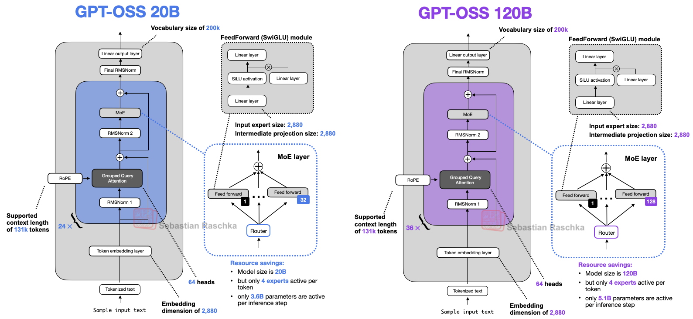

# GPT-3 OSS from Scratch (PyTorch)
Implementation of mini version of the GPT-3 OSS model from scratch in PyTorch.
This repo includes everything needed for dataset preparation, training, inference, and experimentation on small-scale datasets like TinyStories.




---

## 📂 Project Structure

```bash
├── tokenizer.py     # Used the TikToken o200k_harmony model
├── dataset.py       # TinyStories dataset 
└── config.py        # Deals with the model configuration
├── model.py         # GPT-3 OSS architecture (GQA, RoPE, MoE, etc.)
├── train.py         # Training loop (warmup + cosine annealing)
├── inference.py     # Inference / text generation script
├── requirements.txt # Python dependencies
└── README.md        # Project overview

```


---

## 🚀 Features
- **From-scratch Gemma3 implementation**  
  - Grouped-Query Attention
  - Alternate Sliding-Full Attention
  - Transformer Blocks with RMSNorm  
  - Token & Positional Embeddings
  - Weight tying & initialization
  - Query-Key (QK) normalization
  - Rotary Positional Embeddings (RoPE)
  - FeedForward Expert MLP with dual parallel expansion networks
  - Mixture of Experts (MoE)
  
- **Training pipeline**  
  - [TinyStories dataset](https://huggingface.co/datasets/roneneldan/TinyStories) (HuggingFace)  
  - Sliding window dataset loader  
  - Mixed precision training (AMP + GradScaler)  
  - LR warmup + cosine annealing  
  - Gradient clipping & weight decay
    
- **Inference & Generation**  
  - Greedy decoding (deterministic)  
  - [Optional] Top-k sampling for creativity
 
- **Visualization**: Training vs validation loss plots  

---

## 📊 Model Config (default)
```python

GPT_CONFIG = {
    
    "vocab_size": 201088,
    "context_length": 4096,
    "emb_dim": 2880,
    "hid_dim": 2880,
    "head_dim": 64,
    
    "n_heads": 64,
    "n_kv_heads": 8,
    
    "n_layers": 24,
    
    "num_experts": 32,
    "num_active_experts": 4,
    
    "rope_base": 150000.0,
    "sliding_window": 128, 
    "layer_types": [
        "full_attention",
        "sliding_attention",
        "full_attention",
        "sliding_attention",
        "full_attention",
        "sliding_attention",
        "full_attention",
        "sliding_attention",
        "full_attention",
        "sliding_attention",
        "full_attention",
        "sliding_attention",
        "full_attention",
        "sliding_attention",
        "full_attention",
        "sliding_attention",
        "full_attention",
        "sliding_attention",
        "full_attention",
        "sliding_attention",
        "full_attention",
        "sliding_attention",
        "full_attention",
        "sliding_attention",
        
    ],
    "dtype": torch.bfloat16
}

```


## 📦 Installation

```bash
git clone https://github.com/ayushWeb07/nanoGPT-OSS.git
cd nanoGPT-OSS
pip install -r requirements.txt
```

## 📚 Dataset

We use the roneneldan/TinyStories
 dataset, a synthetic dataset of short stories written in simple language, specifically tailored for 4-5 year old kids.

---

## 📚 Usage
### 1️⃣ Prepare Dataset

`python dataset.py`

- Downloads **TinyStories** dataset from HuggingFace.
    
- Saves train data into 'train.bin' and validation data into 'validation.bin'
    

### 2️⃣ Train the Model

`python train.py`

- Runs the training loop with **warmup + cosine scheduler**.
    
- Automatically saves best model weights (`best_model_params.pth`).
    
- Plots train vs validation losses.

### 3️⃣ Run Inference

`python inference.py`

- Initializes a tokenizer from tiktoken

- Creates an input sample: Once upon a time there was a pumpkin.

- Does `language modeling` on the above mentioned sample text

```bash
Text (before generation): Once upon a time there was a pumpkin.
Text (after generation): Once upon a time there was a pumpkin. The pumpkin loved to...
```

---

## 📚 Resources Used

This project was inspired and guided by the following resources:

- [Pretraining OSS- Vizuara](https://www.youtube.com/playlist?list=PLPTV0NXA_ZSiR4_XoR1wy-3bv6J0oZ9Zs)

- [The Illustrated Transformer](https://jalammar.github.io/illustrated-transformer/)


